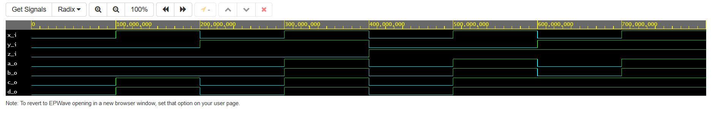

# Zuzana Czmelová - Lab assignment 1 (gates)

## Part 1
(Submit the GitHub link to your Digital-electronics-1 repository)


[My GitHub repository](https://github.com/Zuzanaczm/Digital-electronics-1)


## Part 2
(Verification of De Morgan's laws of function f(c,b,a) )

### Link to my EDA playground example :
[De Morgan's laws](https://www.edaplayground.com/x/mR3s)

### Listing of VHDL code of  - architecture :
```
architecture dataflow of gates is
begin
    f_o  <= ((not b_i) and a_i) or ((not c_i) and (not b_i));
    fnand_o <= not(not((not b_i) and a_i) and not((not c_i) and (not b_i)));
    fnor_o <= not(b_i or (not a_i)) or not(c_i or b_i);

end architecture dataflow;
```
### Table of function values of set variables
| **c** | **b** |**a** | **f(c,b,a)** |
| :-: | :-: | :-: | :-: |
| 0 | 0 | 0 | 1 |
| 0 | 0 | 1 | 1 |
| 0 | 1 | 0 | 0 |
| 0 | 1 | 1 | 0 |
| 1 | 0 | 0 | 0 |
| 1 | 0 | 1 | 1 |
| 1 | 1 | 0 | 0 |
| 1 | 1 | 1 | 0 |

### Screenshot with simulated time waveforms 


## Part 3 
(Verification of Distributive laws)

### Link to my EDA playground example :
[Distributive laws](https://www.edaplayground.com/x/hnqU)

```
architecture dataflow of gates is
begin
    a_o <= (x_i and y_i) or (x_i and z_i);
    b_o <= x_i and (y_i or z_i);
    c_o <= (x_i or y_i) and (x_i or z_i);
    d_o <= x_i or (y_i and z_i);

end architecture dataflow;
``` 

### Screenshot with simulated time waveforms (if functions a=b and c=d)

