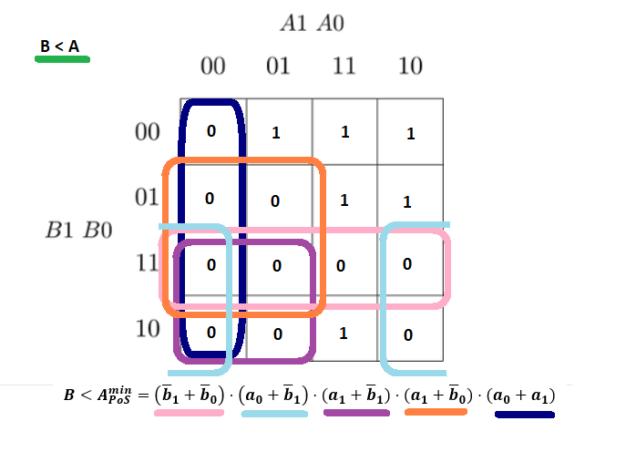

# Zuzana Czmelová - Lab assignment 2 (logic)

[GitHub repository - 02_logic](https://github.com/Zuzanaczm/Digital-electronics-1/tree/main/Labs/02-logic)

## Part 1 - Truth table

**Dec. equivalent** | **B[1:0]** | **A[1:0]** | **B > A** | **B = A** | **B < A** |
| :-: | :-: | :-: | :-: | :-: | :-: |
| 0 | 0 0 | 0 0 | 0 | 1 | 0 |
| 1 | 0 0 | 0 1 | 0 | 0 | 1 |
| 2 | 0 0 | 1 0 | 0 | 0 | 1 |
| 3 | 0 0 | 1 1 | 0 | 0 | 1 |
| 4 | 0 1 | 0 0 | 1 | 0 | 0 |
| 5 | 0 1 | 0 1 | 0 | 1 | 0 |
| 6 | 0 1 | 1 0 | 0 | 0 | 1 |
| 7 | 0 1 | 1 1 | 0 | 0 | 1 |
| 8 | 1 0 | 0 0 | 1 | 0 | 0 |
| 9 | 1 0 | 0 1 | 1 | 0 | 0 |
| 10 | 1 0 | 1 0 | 0 | 1 | 0 |
| 11 | 1 0 | 1 1 | 0 | 0 | 1 |
| 12 | 1 1 | 0 0 | 1 | 0 | 0 |
| 13 | 1 1 | 0 1 | 1 | 0 | 0 |
| 14 | 1 1 | 1 0 | 1 | 0 | 0 |
| 15 | 1 1 | 1 1 | 0 | 1 | 0 |


## Part 2 - A 2-bit comparator 





## Part 3 - A 4-bit comparator

### Link to EDA playground of 4-bit comparator simulation
[My EDA Playground](https://www.edaplayground.com/x/kXdB)

### Design
```
-- Entity declaration for 4-bit binary comparator

entity comparator_4bit is
    port(
        a_i             : in  std_logic_vector(4 - 1 downto 0);
		b_i             : in  std_logic_vector(4 - 1 downto 0);
        --
        B_greater_A_o   : out std_logic;
        B_equals_A_o    : out std_logic;
        B_less_A_o      : out std_logic       
    );
end entity comparator_4bit;


-- Architecture body for 4-bit binary comparator

architecture Behavioral of comparator_4bit is
begin

    B_greater_A_o  <= '1' when (b_i > a_i) else '0';
    B_equals_A_o   <= '1' when (b_i = a_i) else '0';
    B_less_A_o     <= '1' when (b_i < a_i) else '0';

end architecture Behavioral;
```

