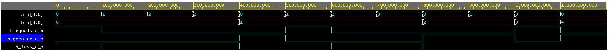

# Zuzana Czmelová - Lab assignment 2 (logic)

[GitHub repository - 02_logic](https://github.com/Zuzanaczm/Digital-electronics-1/tree/main/Labs/02-logic)

## Part 1 - Truth table

**Dec. equivalent** | **B[1:0]** | **A[1:0]** | **B > A** | **B = A** | **B < A** |
| :-: | :-: | :-: | :-: | :-: | :-: |
| 0 | 0 0 | 0 0 | 0 | 1 | 0 |
| 1 | 0 0 | 0 1 | 0 | 0 | 1 |
| 2 | 0 0 | 1 0 | 0 | 0 | 1 |
| 3 | 0 0 | 1 1 | 0 | 0 | 1 |
| 4 | 0 1 | 0 0 | 1 | 0 | 0 |
| 5 | 0 1 | 0 1 | 0 | 1 | 0 |
| 6 | 0 1 | 1 0 | 0 | 0 | 1 |
| 7 | 0 1 | 1 1 | 0 | 0 | 1 |
| 8 | 1 0 | 0 0 | 1 | 0 | 0 |
| 9 | 1 0 | 0 1 | 1 | 0 | 0 |
| 10 | 1 0 | 1 0 | 0 | 1 | 0 |
| 11 | 1 0 | 1 1 | 0 | 0 | 1 |
| 12 | 1 1 | 0 0 | 1 | 0 | 0 |
| 13 | 1 1 | 0 1 | 1 | 0 | 0 |
| 14 | 1 1 | 1 0 | 1 | 0 | 0 |
| 15 | 1 1 | 1 1 | 0 | 1 | 0 |


## Part 2 - A 2-bit comparator 


## Part 3 - A 4-bit comparator

### Link to EDA playground of 4-bit comparator simulation
[My EDA Playground](https://www.edaplayground.com/x/kXdB)

### Design
```vhdl
-- Entity declaration for 4-bit binary comparator

entity comparator_4bit is
    port(
        a_i             : in  std_logic_vector(4 - 1 downto 0);
		b_i             : in  std_logic_vector(4 - 1 downto 0);
        --
        B_greater_A_o   : out std_logic;
        B_equals_A_o    : out std_logic;
        B_less_A_o      : out std_logic       
    );
end entity comparator_4bit;


-- Architecture body for 4-bit binary comparator

architecture Behavioral of comparator_4bit is
begin

    B_greater_A_o  <= '1' when (b_i > a_i) else '0';
    B_equals_A_o   <= '1' when (b_i = a_i) else '0';
    B_less_A_o     <= '1' when (b_i < a_i) else '0';

end architecture Behavioral;
```

### Stimulus process from testbench file (testbench.vhd)
```vhdl
library ieee;
use ieee.std_logic_1164.all;


-- Entity declaration for testbench

entity tb_comparator_4bit is

end entity tb_comparator_4bit;


-- Architecture for testbench

architecture testbench of tb_comparator_4bit is

    -- Local signals
    signal s_a       : std_logic_vector(4 - 1 downto 0);
    signal s_b       : std_logic_vector(4 - 1 downto 0);
    signal s_B_greater_A : std_logic;
    signal s_B_equals_A  : std_logic;
    signal s_B_less_A    : std_logic;

begin
    -- Connecting testbench signals with comparator_2bit entity (Unit Under Test)
    uut_comparator_4bit : entity work.comparator_4bit
        port map(
            a_i           => s_a,
            b_i           => s_b,
            B_greater_A_o => s_B_greater_A,
            B_equals_A_o  => s_B_equals_A,
            B_less_A_o    => s_B_less_A
        );

    --------------------------------------------------------------------
    -- Data generation process
    --------------------------------------------------------------------
    p_stimulus : process
    begin
        -- Report a note at the begining of stimulus process
        report "Stimulus process started" severity note;


        -- 1st test value
        s_b <= "0000"; s_a <= "0000"; wait for 100 ns;
        -- Expected output
        assert ((s_B_greater_A = '0') and (s_B_equals_A = '1') and (s_B_less_A = '0'))
        -- If false, then report an error
        report "Test failed for input combination: 0000, 0000" severity error;
        
        -- 2nd test value
        s_b <= "0000"; s_a <= "0001"; wait for 100 ns;
        -- Expected output
        assert ((s_B_greater_A = '0') and (s_B_equals_A = '0') and (s_B_less_A = '1'))
        -- If false, then report an error
        report "Test failed for input combination: 0000, 0001" severity error;
        
        -- 3rd test value
        s_b <= "0000"; s_a <= "0010"; wait for 100 ns;
        -- Expected output
        assert ((s_B_greater_A = '0') and (s_B_equals_A = '0') and (s_B_less_A = '1'))
        -- If false, then report an error
        report "Test failed for input combination: 0000, 0010" severity error;
        
        -- 4th test value
        s_b <= "0000"; s_a <= "0011"; wait for 100 ns;
        -- Expected output
        assert ((s_B_greater_A = '0') and (s_B_equals_A = '0') and (s_B_less_A = '1'))
        -- If false, then report an error
        report "Test failed for input combination: 0000, 0011" severity error;
        
        -- 5th test value
        s_b <= "0001"; s_a <= "0000"; wait for 100 ns;
        -- Expected output
        assert ((s_B_greater_A = '1') and (s_B_equals_A = '0') and (s_B_less_A = '0'))
        -- If false, then report an error
        report "Test failed for input combination: 0001, 0000" severity error;
        
        -- 6th test value
        s_b <= "0001"; s_a <= "0001"; wait for 100 ns;
        -- Expected output
        assert ((s_B_greater_A = '0') and (s_B_equals_A = '1') and (s_B_less_A = '0'))
        -- If false, then report an error
        report "Test failed for input combination: 0001, 0001" severity error;
        
        -- 7th test value
        s_b <= "0001"; s_a <= "0010"; wait for 100 ns;
        -- Expected output
        assert ((s_B_greater_A = '0') and (s_B_equals_A = '0') and (s_B_less_A = '1'))
        -- If false, then report an error
        report "Test failed for input combination: 0001, 0010" severity error;
        
        -- 8th test value
        s_b <= "0001"; s_a <= "0011"; wait for 100 ns;
        -- Expected output
        assert ((s_B_greater_A = '0') and (s_B_equals_A = '0') and (s_B_less_A = '1'))
        -- If false, then report an error
        report "Test failed for input combination: 0001, 0011" severity error;
        
        -- 9th test value
        s_b <= "0010"; s_a <= "0000"; wait for 100 ns;
        -- Expected output
        assert ((s_B_greater_A = '1') and (s_B_equals_A = '0') and (s_B_less_A = '0'))
        -- If false, then report an error
        report "Test failed for input combination: 0010, 0000" severity error;
        
        -- 10th test value
        s_b <= "0010"; s_a <= "0001"; wait for 100 ns;
        -- Expected output
        assert ((s_B_greater_A = '1') and (s_B_equals_A = '0') and (s_B_less_A = '0'))
        -- If false, then report an error
        report "Test failed for input combination: 0010, 0001" severity error;
        
        
        
        -- Error test value
        s_b <= "0011"; s_a <= "0011"; wait for 100 ns;
        -- Expected output
        assert ((s_B_greater_A = '0') and (s_B_equals_A = '0') and (s_B_less_A = '1'))
        -- If false, then report an error
        report "Test failed for input combination: 0011, 0011" severity error;
        
        
        -- 11th test values
        s_b <= "0100"; s_a <= "0000"; wait for 100 ns;
        -- Expected output
        assert ((s_B_greater_A = '1') and (s_B_equals_A = '0') and (s_B_less_A = '0'))
        -- If false, then report an error
        report "Test failed for input combination: 0100, 0000" severity error;


        -- Report a note at the end of stimulus process
        report "Stimulus process finished" severity note;
        wait;
    end process p_stimulus;

end architecture testbench;
```
### Console output 


### Simulated waveforms

