# Zuzana Czmelová - Lab assignment 3 (vivado)

[GitHub repository - 03_vivado](https://github.com/Zuzanaczm/Digital-electronics-1/tree/main/Labs/03-vivado)

## Part 1 - Table with connection of 16 slide switches and 16 LEDs on Nexys A7 board
**Notice : LEDs are active-high = LEDs are switched with logic value 1

**Switches** | **Pins** | **LEDs** | **Pins**
------------ | ---------- | -------| ------
00 | J15     | 00| H17
01 | L16     |  01|K15
02 |  M13    | 02|J13
03 | R15     |03|N14  
04| R17    |04|R18 
05| T18|05|V17 
06| U18|06|U17 
07| R13 |07|U16 
08| T8    |08|V16
09| U8    |09|T15
10| R16|10|U14  
11| T13 |11|T16  
12| H6 |12| V15
13| U12|13|V14
14|  U11 |14|V12
15|V10| 15|V11  

[Link to Nexys-A7-50T](https://github.com/Digilent/digilent-xdc/blob/master/Nexys-A7-50T-Master.xdc)

## Part 2 - Two-bit wide 4-to-1 multiplexer

**Listing of VHDL architecture from source file mux_2bit_4to1.vhd**
```vhdl
architecture Behavioral of mux_2bit_4to1 is
begin

       f_o  <= a_i when (sel_i = "00") else
               b_i when (sel_i = "01") else
               c_i when (sel_i = "10") else
               d_i;

end architecture Behavioral;
```

**Listing of VHDL stimulus process from testbench file tb_mux_2bit_4to1.vhd**
```vhdl
p_stimulus : process
    begin
       
        report "Stimulus process started" severity note;
       s_d <= "00"; s_c <= "00"; s_b <= "00"; s_a <= "00" ;
       s_sel <= "00" ; wait for 10ns; 

       s_d <= "10"; s_c <= "01"; s_b <= "01"; s_a <= "00" ;
       s_sel <= "00" ; wait for 10ns; 
        
       s_d <= "10"; s_c <= "01"; s_b <= "01"; s_a <= "11" ;
       s_sel <= "00" ; wait for 10ns; 
       
       s_d <= "10"; s_c <= "01"; s_b <= "01"; s_a <= "00" ;
       s_sel <= "01" ; wait for 10ns; 
       
        s_d <= "10"; s_c <= "01"; s_b <= "11"; s_a <= "00" ;
       s_sel <= "10" ; wait for 10ns; 
       
       s_d <= "10"; s_c <= "01"; s_b <= "11"; s_a <= "00" ;
       s_sel <= "11" ; wait for 10ns; 
       
        report "Stimulus process finished" severity note;
        wait;
    end process p_stimulus;
```

**Screenshot with simulated time waveforms**


## Part 3 - A Vivado tutorial

### A) Creating a project

#### 1.Create a project
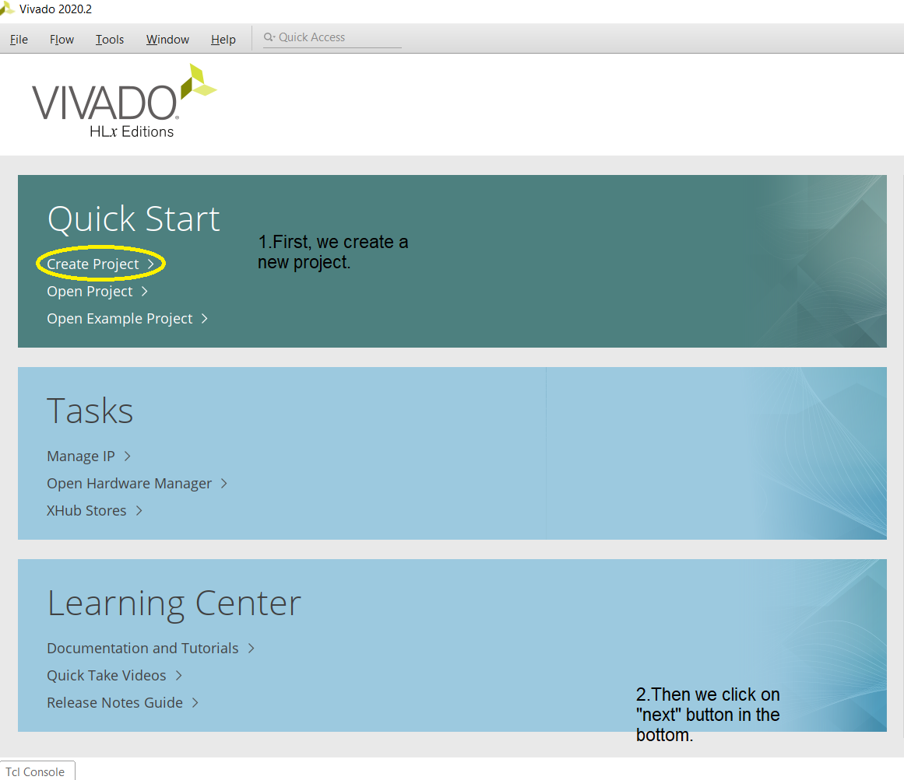
#### 2.Project name

#### 2.Project type

#### 3. Adding constraints (optional - in Part D)

#### 4. Adding sources ( in Part B too)

#### 5.Default part

#### 6. New project summary


### B) Adding source file 
#### 1. Add sources
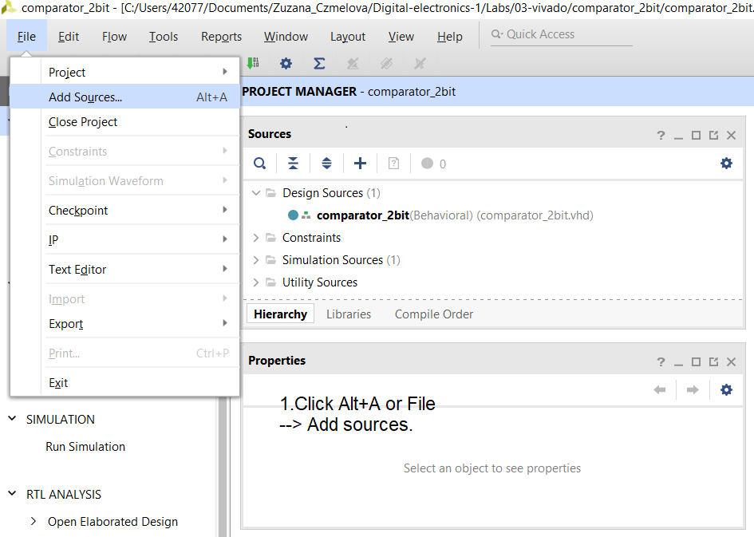
#### 2. Choose design sources
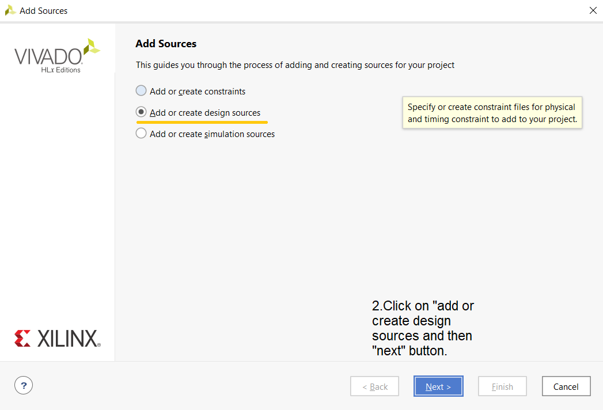
#### 3. Add or create design sources
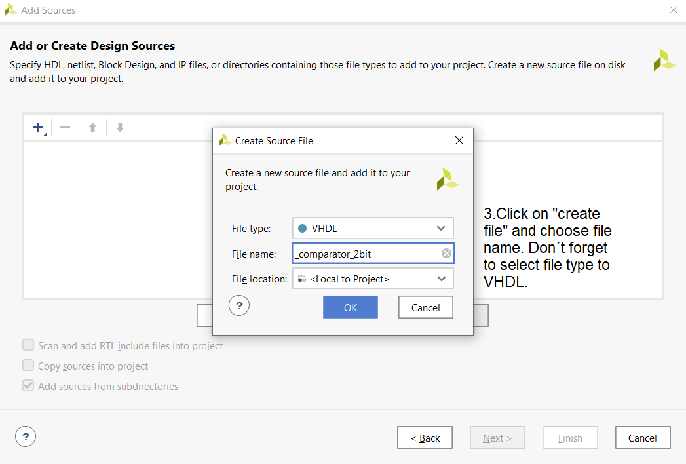
#### 4. Define module
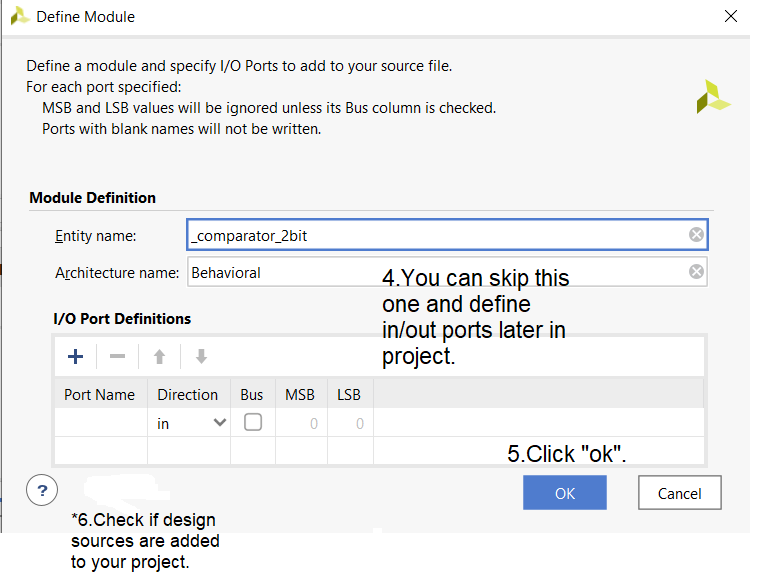

### C) Adding testbench file 
**firstly, you click ALT+A for adding sources like in previous part (=adding source file)**

#### 1. Choose simulation sources 
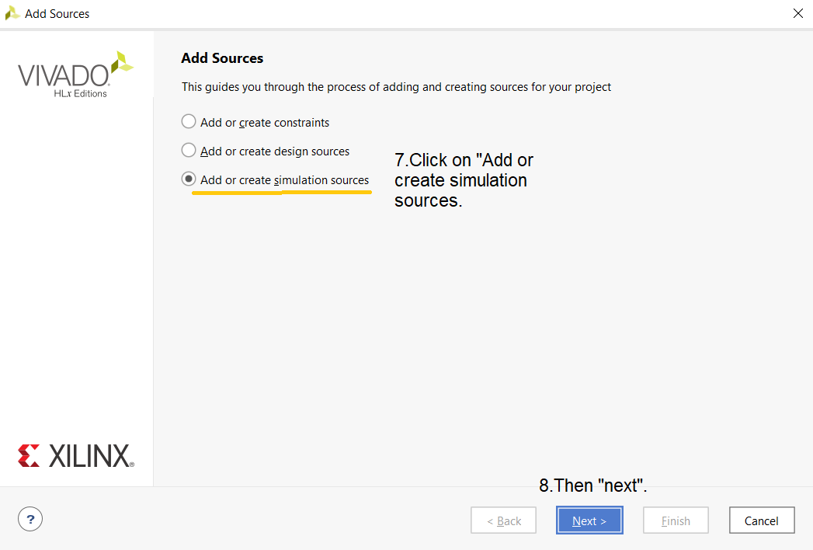
#### 2. Add or create simulation sources
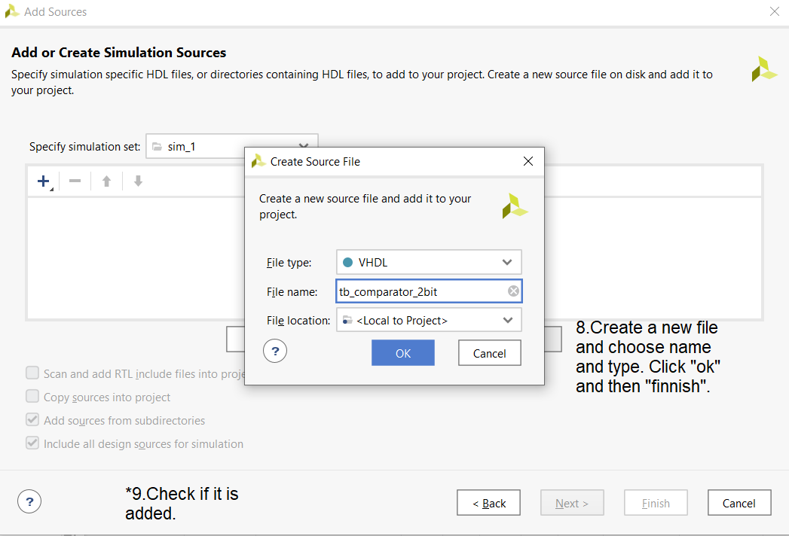

### D) Adding XDC constraints file
#### 1. Choose "add or create constraints"
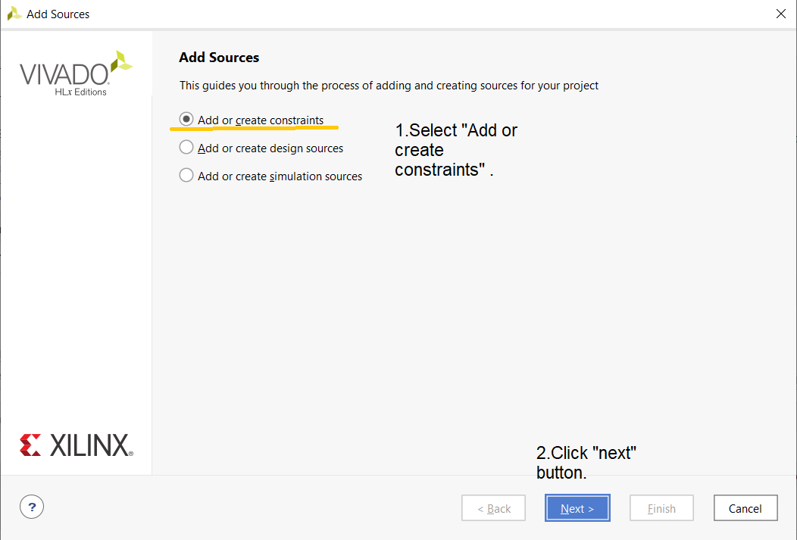
#### 2. Naming constraints file
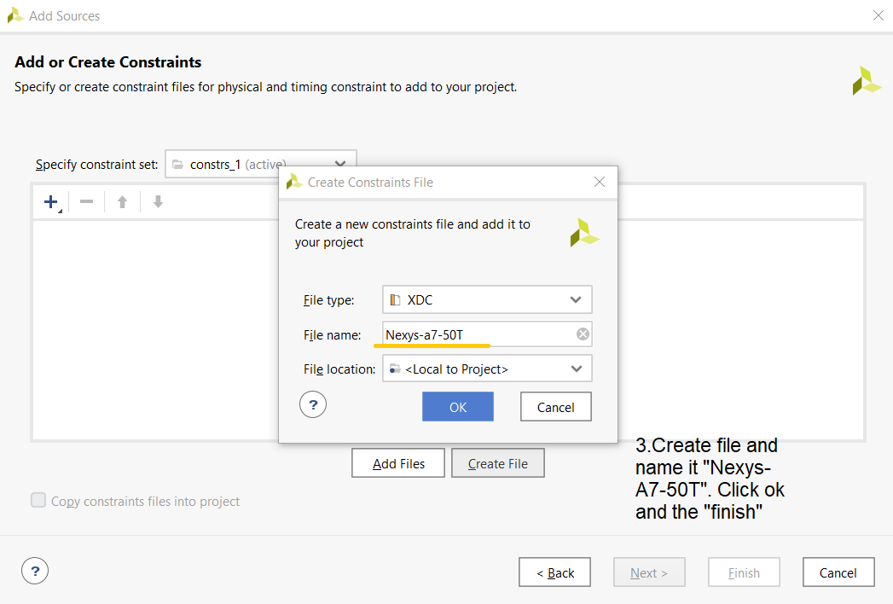
#### 3. Checking if it is added 
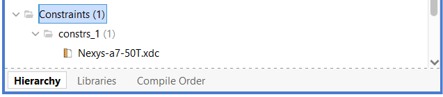

### D) Running a simulation
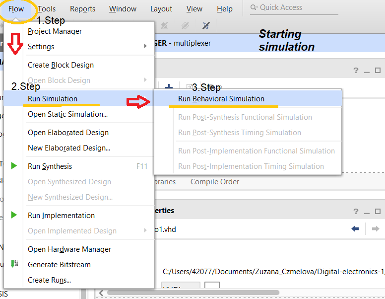


