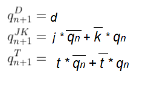

# Zuzana Czmelová - Lab assignment (Latches and Flip flops) 

## Part 1 - Characteristic equations and  truth tables for D, JK, T flip-flops
### A) D flip-flop

   | **D** | **Qn** | **Q(n+1)** | **Comments** |
   | :-: | :-: | :-: | :-- |
   | 0 | 0 | 0 | No Change |
   | 0 | 1 | 0 | Reset |
   | 1 | 0 | 1 | Set |
   | 1 | 1 | 1 | No Change |
   
  
 ### B) JK flip-flop

   | **J** | **K** | **Qn** | **Q(n+1)** | **Comments** |
   | :-: | :-: | :-: | :-: | :-- |
   | 0 | 0 | 0 | 0 | No change |
   | 0 | 0 | 1 | 1 | No change |
   | 0 | 1 | 0 | 0 | Reset |
   | 0 | 1 | 1 | 0 | Reset |
   | 1 | 0 | 0 | 1 | Set |
   | 1 | 0 | 1 | 1 | Set |
   | 1 | 1 | 0 | 1 | Toggle |
   | 1 | 1 | 1 | 0 | Toggle |
   
   ### C) T flip-flop
   
   | **T** | **Qn** | **Q(n+1)** | **Comments** |
   | :-: | :-: | :-: | :-- |
   | 0 | 0 | 0 | No change |
   | 0 | 1 | 1 | No change |
   | 1 | 0 | 1 | Invert |
   | 1 | 1 | 0 | Invert |




## Part 2 - VHDL code for D latch

### A) VHDL code of design source
```vhdl
p_d_latch : process(d, arst, en)
begin
         if (arst = '1') then        
              q     <= '0';
              q_bar <= '1';
         elsif (en = '1') then       
              q     <= d;
              q_bar <= not d;    
         end if;                     
 end process p_d_latch;
```

### B) VHDL reset and stimulus processes from the testbench tb_d_latch.vhd 
```vhdl
p_reset_gen : process
begin
    s_arst <= '1';
    wait for 50 ns;
    s_arst <= '0';
    wait for 75 ns;
    s_arst <= '1';
    wait for 100 ns;
    s_arst <= '0';
    wait for 275 ns;        
    s_arst <= '0';
    wait for 150 ns;
    s_arst <= '1';
    wait for 50 ns;
    s_arst <= '0';
    wait for 100 ns;
     s_arst <= '1';
    wait for 20 ns; 
    s_arst <= '0';
    wait for 200 ns;  
end process p_reset_gen;


p_stimulus : process
begin
    report "Stimulus process started" severity note;

    s_en     <= '1';
    s_d <= '1';
    wait for 50 ns;       
    s_d <= '0';
    wait for 50 ns; 
    s_d <= '1';
    wait for 50 ns;  
    s_d <= '0';
    wait for 50 ns;     
    s_d <= '1';
    wait for 50 ns;

    assert ((s_q = '1') and (s_q_bar = '0' ))
    -- If false, then report an error
    report "Test failed for input: '1' " severity error;
        
    s_d <= '0';
    wait for 50 ns;
    s_d <= '1';
    wait for 50 ns;
    s_d <= '0';
    wait for 50 ns;;   
    s_d <= '1';
    wait for 50 ns;
     s_d <= '0';
    wait for 50 ns;
  
    
    
    assert ((s_q = '0') and (s_q_bar = '1' ))
    report "Test failed for input: '0' " severity error;
    
    s_d <= '1';
    wait for 25 ns; 
    s_en     <= '0';
    wait for 25 ns;     
    s_d <= '0';
    wait for 50 ns; 
    s_d <= '1';
    wait for 50 ns   
    s_d <= '0';
    wait for 50 ns;     
    s_d <= '1';
    wait for 25 ns;
    
    s_en     <= '1';
    wait for 25 ns;
    s_d <= '0';
    wait for 50 ns;
     s_d <= '1';
    wait for 50 ns;
     s_d <= '0';
    wait for 50 ns;  
    s_d <= '1';
    wait for 50 ns;     
    s_d <= '0';
    wait for 50 ns;
    
    report "Stimulus process finished" severity note;
    wait;
end process p_stimulus;
```

### C) Screenshot with simulated time waveforms


## Part 3 - Flip-flops
